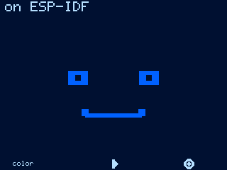
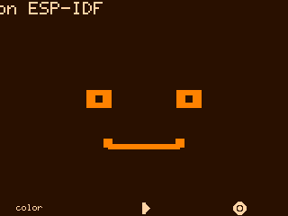
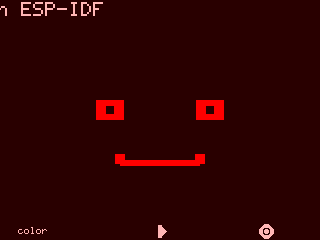
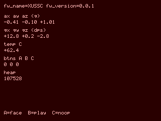
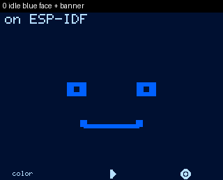

# esprec

**ESP32 screen capture for agents** — the [tuirec](https://github.com/tui-cs/tuirec) *analogue* for devices with displays (mission kinship, not a port of tuirec’s pipeline).

On command, product firmware emits a full-frame shadow over USB serial (text-safe base64). The **host** post-processes frames into **PNG** (still) or **GIF** (keyframe or continuous sequence). Primary audience: **AI agents** working on [Silico](https://github.com/tig/silico) GCUs.

## Hero: real metal (Xuss-C / M5GO)

Unlabeled 320×240 panels captured over USB with `esprec` + ESPREC1 integrity (not a desk camera). Banner, themes, and Details firmware line are product pixels.

| Idle (blue) | Theme (orange) | Theme (red) | Details |
|-------------|----------------|-------------|---------|
|  |  |  |  |

**Keyframe sequence** (product stills only):


**Narrative GIF** (captions padded *above* the panel — never over product chrome):



### Continuous / realtime session (issue #3)

Device samples the shadow into **RAM if it holds the full session**, else **SPIFFS flash**, without base64 during capture. Host later runs `esprec spool` and builds a GIF with real `ts_ms` delays (~5 Hz living UI on ESP32).

```text
esprec spool --port COMx --duration 3 --hz 5 -o live.gif
# wire: esprec rec start 5 3 → …UI samples… → esprec rec stop → esprec spool
```

Reproduce on a flashed Xuss-C (GCU scenario lives in the product repo):

```text
# from tig/xuss-c (requires: pip install -e ../esprec)
python tools/screen_scenario.py --port COMx -o docs/examples
# optional captions *above* the panel for demos:
python tools/screen_scenario.py --port COMx -o docs/examples --gif-captions
```

Library (preferred over re-assembling grab + encode in product scripts):

```python
from esprec.serial_port import open_port
from esprec.capture import snapshot, record

ser = open_port("COM7")
try:
    snapshot(ser, "face.png", command="shot", settle_s=1.0)
finally:
    ser.close()
```

## Status

Implemented host CLI + ESPREC1 protocol + ESP-IDF component + unit gate. Specs under [`specs/`](specs/).

## Install (host)

```text
python -m pip install -e ".[dev]"
esprec agent-guide
esprec snapshot --fake -o face.png    # offline
esprec snapshot --port COMx -o face.png
esprec record --port COMx --frames 5 --hz 2 -o clip.gif
```

**Named unit gate:**

```text
python -m pytest -q
```

## Wire (ESPREC1)

```text
Host →  esprec shot\n   (alias: shot\n)
Dev  →  ESPREC1 w=… h=… fmt=rgb565be pack=spi_be enc=b64 nbytes=N crc=0x…
Dev  →  base64 lines (76 cols)
Dev  →  ESPREC1_END crc=0x…
```

CRC32 covers **canonical metadata + raster** (fails closed on truncate, **overlong**, metadata tamper, or **missing end delimiter**). Legacy `SHOT` (pixels-only CRC) is still accepted for older firmware.

## On-device component

```text
component/esprec/   # idf_component_register; include esprec.h
esprec_emit_rgb565_spi_be(shadow, w, h);
```

Products maintain a full-frame **shadow** (panel GRAM readback not required). See `specs/spec.md`.

## Silico

PNG/GIF is **agent evidence**. Operator **product face** confirm remains required for first-ship metal. Do not redefine GCU `sim/` as QEMU. Detail: silico `knowledge/esprec.md`.

## License

Apache-2.0 (aligned with silico).
