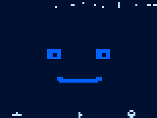
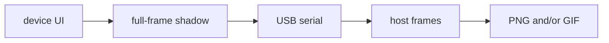

# esprec

**ESP32 screen capture for agents** - same job as my popular [tuirec](https://github.com/tui-cs/tuirec) for terminal UIs: see what's on the glass without a camera. On command, product firmware emits a full-frame shadow over USB serial (text-safe base64). The **host** post-processes frames into **PNG** (still) or **GIF** (keyframe or continuous sequence). Primary audience: **AI agents** working on [Silico](https://github.com/tig/silico) GCUs.

**AGENTS:** See [AGENTS.md](AGENTS.md) for how to use esprec.

## Getting Started

Simply tell your coding agent:

### One time capture

> "Use tig/esprec to capture an image of my device after boot and add it to my repos README.md as a hero image."

### Screen validation as part of continuous integration testing

> "Use tig/esprec to create goldens of feature x, y, and z. Then build tests that run as part of CI that fail if the firmware running on qemu ever deviates from the goldens."

### Iterative UX development

> "./mockup.html is an html mockup of the UI I want on my device. Build this UI using LVGL for real on the device [or qemu emulating my device]. Use tig/esprec to capture each screen as you build it, and iteratively refine the code you write until the real device UI matches the html mockup."

The agent installs the host tool, links the on-device component, and runs capture. You don’t.

## Example

`xuss-c` is an example used to demonstrate [Silico](https://github.com/tig/silico). `xuss-c` is a M5GO device with a 320x240 display. **esprec** captured these over USB with `esprec` + ESPREC1 integrity (not a desk camera). Banner, themes, and Details firmware line are product pixels.

| Idle (blue) | Theme (orange) | Theme (red) | Details |
|-------------|----------------|-------------|---------|
|  |  |  |  |

**Keyframe sequence** (product stills only):


**Narrative GIF** (captions padded *above* the panel; never over product chrome):


**Living face @ ~5 Hz** (metal, Xuss-C / M5GO; play the GIF; single stills look almost identical at quarter-res):



Native 80×60 stream (same delays): [xuss-c-living-realtime.gif](docs/examples/xuss-c-living-realtime.gif)

**Re-record heroes** (metal Xuss-C + esprec host): see [docs/examples/README.md](docs/examples/README.md) and `scripts/xuss_c_*.py`.

---

## How it works (Deep dive)



Two cooperating halves. **On-device** (`component/esprec`) captures and emits only; no GIF/PNG on metal. **Host** (this CLI/library) requests frames, checks integrity, post-processes. Wire is **ESPREC1**: text-safe base64, CRC over **metadata + raster**, fail closed on truncate/tamper. 

Product firmware must link the component, keep a full-frame RGB565 shadow of what was last painted (strip blits alone are not enough; panel GRAM readback is optional and often wrong), and answer `esprec shot` / `shot` with `esprec_emit_rgb565_spi_be`. Hush `ESP_LOG` during emit or logs corrupt the payload.

### Host

Agents install this. Humans can use it for debugging:

```text
# sibling: .../tig/esprec next to .../tig/<gcu>
python -m pip install -e "../esprec[dev]"
# or: python -m pip install "git+https://github.com/tig/esprec.git"

esprec agent-guide
esprec snapshot --fake -o face.png
esprec snapshot --port COMx -o face.png
esprec record --port COMx --frames 5 --hz 2 -o clip.gif
esprec spool --port COMx --duration 3 --hz 5 -o live.gif
```

Full-panel stills @ 115200 take seconds; defaults are honest about that. Prefer one open session for multi-snap scripts (`open_port` keeps DTR/RTS low so ESP auto-reset does not black the first frame).

```python
from esprec.serial_port import open_port
from esprec.capture import snapshot, spool_to_gif

ser = open_port("COM7")
try:
    snapshot(ser, "face.png", command="shot", settle_s=1.0)
    spool_to_gif(ser, "live.gif", duration_s=3.0, hz=5.0)
finally:
    ser.close()
```

### The on-device component

```text
component/esprec/   # idf_component_register; include esprec.h
esprec_emit_rgb565_spi_be(shadow, w, h);
```

### Continuous / realtime session

Device samples the shadow into **RAM if it holds the full session**, else **SPIFFS flash**, without base64 during capture. Host later runs `esprec spool` and builds a GIF with real `ts_ms` delays (~5 Hz living UI on ESP32). Continuous store is quarter-res (80x60) so SPIFFS can keep up; README GIF above is NN-upscaled to 320x240.

```text
esprec spool --port COMx --duration 3 --hz 5 -o docs/examples/xuss-c-living-realtime.gif
# wire: esprec rec start 5 3 [max] → …UI samples… → esprec rec stop → esprec spool
```

Keyframe / living re-record (Xuss-C product scenarios in this repo):

```text
# from esprec checkout (requires: pip install -e ".[dev]"; metal running Xuss-C)
python scripts/xuss_c_screen_scenario.py --port COMx -o docs/examples
python scripts/xuss_c_demo_record.py --port COMx -o docs/examples --captions
esprec spool --port COMx --duration 3 --hz 5 -o docs/examples/xuss-c-living-realtime.gif
```

### Specs

| | |
|--|--|
| [AGENTS.md](AGENTS.md) | Agent playbook for the Getting Started prompts |
| [specs/spec.md](specs/spec.md) | Requirements |
| [specs/ci.md](specs/ci.md) | Unit → QEMU → optional metal |
| `python -m pytest -q` | Host unit gate |
